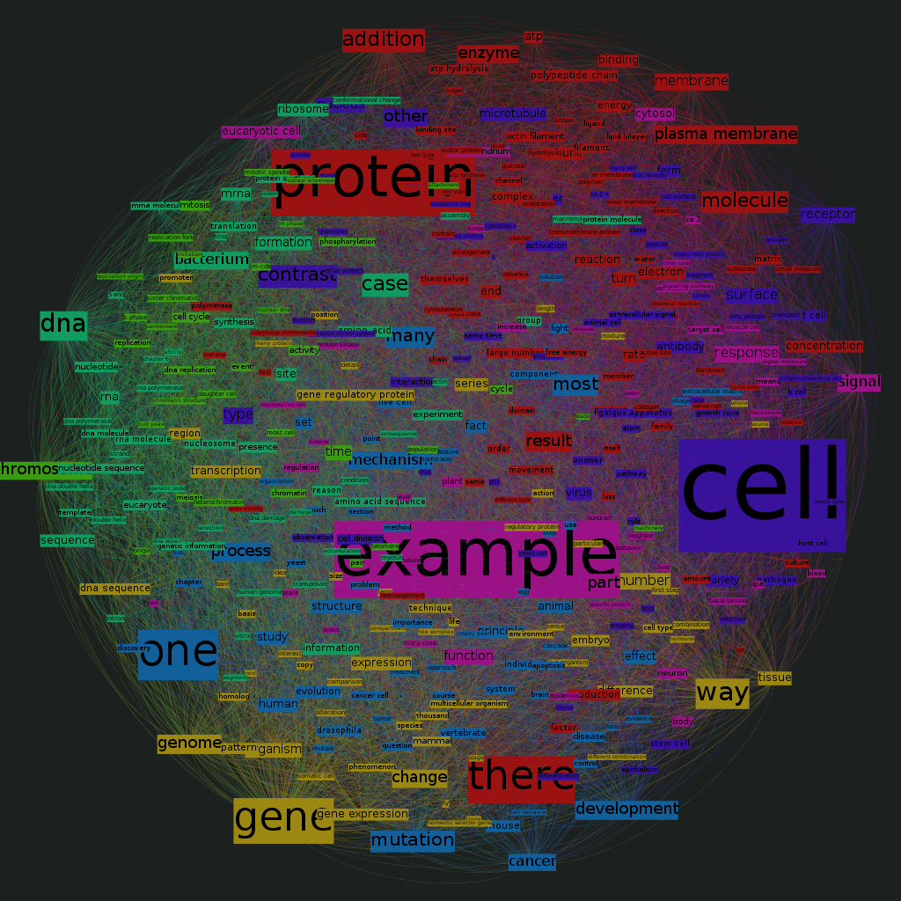

# Text-network Compiler

Produces text-networks from the contents of textbooks.

## Usage

Compile the contents of a textbook into a [GEXF 1.2](http://gexf.net/format/index.html) file, a graph file format.

    ./Compiler -f an_output_file.gexf < an_input_file.txt

## Dependencies

- SBT 0.13.0 +
- Scala 2.10 +
- GNU Make
- Gephi 0.8.2-beta

## Build
    make

